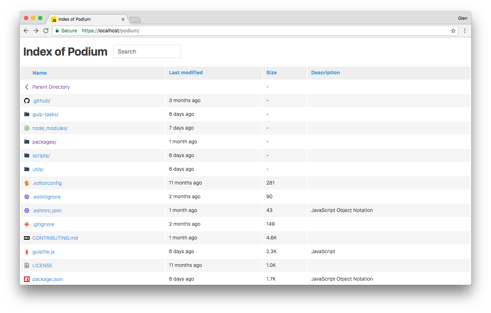
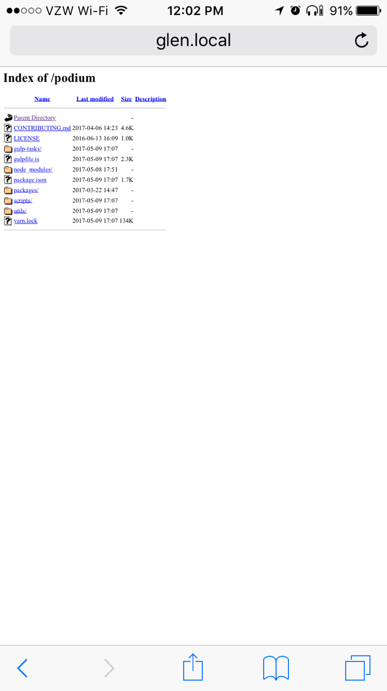

# Fancy Index

A responsive Apache index page.

Inpired by:
  + [Fancy-Index](https://github.com/Vestride/fancy-index) as fork and implemented some requests
  + [Seti UI](https://github.com/jesseweed/seti-ui)
  + [atom file-icons](https://github.com/file-icons/atom)

In addition there are an implementation of lightbox for images files

### Before Fancy Index:

### After Fancy Index

## Setup

I'm going to assume you're using a `Sites` folder with apache, but it could be done differently. Wherever you see `USERNAME`, use your username.

1. Clone or download the files to any location. For example `/usr/share/fancy-index`.
  + Copy `fancy-index.inc` to your Apache `sites.d` directory. Usually `/etc/httpd/conf/sites.d/`.
  + Include this file to the Virtual Host you want to have a fancy index. `Include /etc/httpd/conf/sites.d/fancy-index.inc`
  + Restart your webserver.

## Mobile Comparison

Now you don't have to zoom in or be a sniper with your finger!

| Default  | Fancy  |
|:--------:|:------:|
|  |  |

## Customizing hidden files and directories

If you want to hide some files or directories, for example the `fancy-index` directory, there is a `IndexIgnore` directive in `.htaccess` file.

1. Edit `.fancy-index.inc` file in  `sites.d` directory.
2. Look for the "IGNORE THESE FILES" section.
3. Update the `IndexIgnore` directive with the path of files and directories to hide, separated by spaces.
	* For example: `IndexIgnore .ftpquota .DS_Store .git /fancy-index`
4. Save the changes.
5. Restart your webserver.
